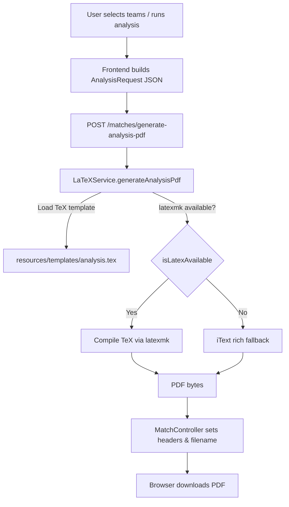

# ChambuaVismart Fixture Analysis PDF Generation — Technical Report

This document explains the current PDF generation flow for the "fixture analysis" report in the ChambuaVismart app. It is intended as a developer-oriented overview of how data flows from the UI through the backend to generate a PDF, the tools and templates used, and the behaviors/limitations to be aware of.

Note: This report documents the system as it exists in the codebase today. It does not propose or implement changes.

## Overview of PDF Generation Flow

- Trigger: The frontend calls a backend endpoint to generate a PDF from a structured AnalysisRequest payload.
- Engine strategy:
  - Primary path: LaTeX (latexmk) compiles a TeX template into PDF.
  - Fallback path: If LaTeX/latexmk is unavailable or fails, the backend uses programmatic PDF generation via iText 8 to produce a rich, styled PDF. If that also fails, a minimal emergency PDF is produced.
- Output: A PDF is streamed back to the browser with a Content-Disposition attachment filename that includes both team names.

Flow in text/Mermaid:

### Triggers
- Frontend service method: `match.service.ts -> generateAnalysisPdf(payload)`
  - Makes `POST` to: `/matches/generate-analysis-pdf` (backend)
  - Expects Blob response with `Content-Type: application/pdf`

### Dependencies
- Backend framework: Spring Boot 3.2.5 (Java 17)
- PDF generation:
  - Primary: LaTeX (invoked via `latexmk` external tool)
  - Fallback: iText 8.0.5 (`kernel`, `layout`, `io`)
- Template: LaTeX file `src/main/resources/templates/analysis.tex`
- Other notable libs: Spring Web, Data JPA, MySQL connector (runtime), Flyway

## Data Inputs and Sources

The AnalysisRequest payload combines pre-computed analysis results from the application. Key structures (as in `AnalysisRequest.java`):

- Root fields:
  - `totalMatches: long` — total count used for overall context line
  - `teamA: Team` — home/primary team summary
  - `teamB: Team` — away/secondary team summary
  - `h2h: H2H` — head-to-head insights and tables
  - `predictions: Predictions` — win/draw/loss, BTTS, overs, and top correct scores

- Team:
  - `name, matchesInvolved, wins, draws, losses, btts, over15, over25`

- H2H:
  - `insights: String`
  - `goalDifferential: double` (aggregate, A-perspective)
  - `averageGD: double`
  - `last5TeamA: Last5`, `last5TeamB: Last5` where `Last5 = { streak, winRate, points, recent[] }`
  - `history: Row[]`, `allOrientations: Row[]` where `Row = { year, date, match, result }`

- Predictions:
  - `win, draw, loss, btts, over15, over25, over35` (percent integers)
  - `correctScores: Score[]` where `Score = { score: String, probability: double }`

Sources/Preparation
- The data in AnalysisRequest is prepared by the app’s services/controllers prior to PDF generation; the PDF layer assumes the payload is already computed and formatted for display. H2H and form-related data is served by endpoints in `MatchController` and associated services (`H2HService`, `FormGuideService`) not detailed here beyond their outputs.
- For diagnostics and parity with frontend estimations, the controller includes `/verify-correct-scores` (Poisson-based grid) that can be used to cross-check correct-score probabilities, but this is not part of the PDF generation path.

Validation/Formatting before PDF
- LaTeX layer applies minimal escaping for special characters to prevent TeX compilation errors.
- Tables default to “No matches found” when arrays are empty.

## PDF Generation Mechanics

### Primary: LaTeX via latexmk
- Service: `LaTeXService.generateAnalysisPdf(req)`
- Steps:
  1. Load template `templates/analysis.tex` from classpath.
  2. Interpolate placeholders with data from `AnalysisRequest` (includes basic escaping).
  3. Check availability of `latexmk`:
     - Environment variable/system property can force-disable via `DISABLE_LATEXMK`.
     - Searches typical paths: `/usr/bin/latexmk`, and Windows: `C:\texlive\20xx\bin\win32\latexmk.exe`.
     - Attempts `latexmk --version` on PATH.
  4. If available, write temporary `analysis.tex` and run latexmk with `-pdf -interaction=nonstopmode -halt-on-error`.
  5. Read the generated `analysis.pdf` and return bytes.
- Page size/margins: defined in template using `\documentclass[a4paper,12pt]{article}` and `\geometry{margin=1in}`.
- Watermark: LaTeX adds a rotated “Powered by ChambuaVismart” watermark using `eso-pic` + `tikz` at page center with opacity.
- Typography: Uses `noto` package (Noto fonts) if available in LaTeX env.

### Template system
- File: `backend/src/main/resources/templates/analysis.tex`
- Placeholders: `{{TITLE}}`, `{{TEAM_A_NAME}}`, `{{H2H_HISTORY_ROWS}}`, `{{CORRECT_SCORES_ROWS}}`, etc.
- Sections rendered:
  - Title + total matches line
  - Team summaries (two-column key-value table for Team A and Team B)
  - H2H insights + GD + last-5 summaries
  - Two H2H tables: chosen orientation; all orientations
  - Fixture analysis results (outcome probabilities)
  - Most probable correct scores (top ~10 rows)

### Fallback: iText 8 rich PDF
- If latexmk is missing or fails, the service generates a readable, styled PDF with iText 8:
  - A4 pages, 1-inch margins
  - Title, sections, and tables corresponding to the same data as the template
  - Page event adds a diagonal watermark “Powered by ChambuaVismart” centered on each page, semi-transparent
  - Compression disabled for easier text search/verification (useful for tests and debugging)

### Minimal emergency PDF
- In the unlikely event both LaTeX and iText fail, a tiny valid PDF is emitted with a single title line. This keeps the UX responsive.

### Filename logic and response
- Controller: `MatchController.generateAnalysisPdf`
  - Filename: `analysis-{home}-vs-{away}.pdf` where team names are sanitized to `[A-Za-z0-9_]+`
  - Headers: `Content-Type: application/pdf`, `Content-Disposition: attachment; filename=...`
  - On error: status 500 with a small PDF-like payload noting the error (still served as `application/pdf`).

## Layout and Styling Details

Current layout (LaTeX template):
- Paper: A4 portrait, 12pt base font
- Margins: 1 inch
- Fonts: Noto (via `\\usepackage{noto}`) if available in TeX installation
- Tables: `booktabs` for \toprule/\midrule/\bottomrule styling
- Watermark: Diagonal, light opacity, centered
- Color: Primarily grayscale; no explicit brand colors defined in template

Current layout (iText fallback):
- A4 portrait, 1-inch margins
- Tables with thin gray borders for readability
- Same watermark string applied per page via event handler
- Section headings use bold weight; top-level title centered

Multi-page handling:
- LaTeX: Natural pagination handled by TeX; tables will continue on next page if long (no custom page-break logic).
- iText: Document grows as elements are added. Long tables or many rows will spill onto subsequent pages automatically.

## Current Limitations and Behaviors

- Pagination and page count vary with content size:
  - Extensive H2H tables (history and all-orientation) can cause 2–3 pages or more.
  - Correct scores up to 10 rows are included by default in LaTeX; iText renders up to provided list size (capped in code to 10 in the LaTeX string builder; iText method also limits to 10).
- Visual style is intentionally plain for clarity and PDF portability; no logos or theme colors are currently embedded.
- Fonts depend on LaTeX environment (Noto package availability). If unavailable, LaTeX may fall back to defaults.
- Filename depends solely on team names present in payload; if null, defaults become `TeamA`/`TeamB`.
- Minimal escaping for LaTeX is implemented; more complex text (e.g., unmatched braces) could still require additional handling in edge cases.
- Long team names are sanitized for the filename but fully displayed in the PDF content.
- Dates are treated as plain strings; formatting is assumed to be handled upstream.

## Integration Points

- Frontend (Angular): `frontend/src/app/services/match.service.ts`
  - `generateAnalysisPdf(payload)` POSTs to backend and expects a Blob (for download).
- Backend (Spring Boot): `MatchController` exposes the endpoint and delegates to `LaTeXService`.
- Configuration: Application timezone set to `Africa/Nairobi` at startup (not directly related to PDF generation, but relevant for timestamp consistency elsewhere).

## Extensibility Notes

- Adding brand colors, logos, or themes:
  - LaTeX: Update `analysis.tex` to include color packages and brand assets; add images via `\\includegraphics` and define color palette.
  - iText: Extend table cell styles, add brand color constants, and include image resources in the fallback generator.
- To force one-page layout (if feasible):
  - Reduce font sizes, tighten margins, compress tables (e.g., limit H2H rows), or collapse sections.
- To add internationalization: Ensure escaped text covers a wider set of LaTeX-sensitive characters; consider unicode packages in LaTeX and proper fonts.

## Key Files & Classes

- `backend/src/main/java/com/chambua/vismart/service/LaTeXService.java`
  - `generateAnalysisPdf(AnalysisRequest)` — orchestrates template/fallback selection
  - `buildLatexFromTemplate(...)` — placeholder interpolation
  - `compileLatex(...)` — runs latexmk
  - `buildRichPdfFallback(...)` — iText generation with sections and watermark
  - `minimalPdf(...)`, `buildSimplePdfFallback(...)` — emergency fallbacks
- `backend/src/main/resources/templates/analysis.tex` — LaTeX template
- `backend/src/main/java/com/chambua/vismart/controller/MatchController.java`
  - `POST /matches/generate-analysis-pdf` endpoint, sets headers and filename
- Frontend service: `frontend/src/app/services/match.service.ts` — `generateAnalysisPdf`
- Maven: `backend/pom.xml` — declares iText 8 dependencies

---

This report documents the current state as of 2025-09-18. Ready for review and feedback.
